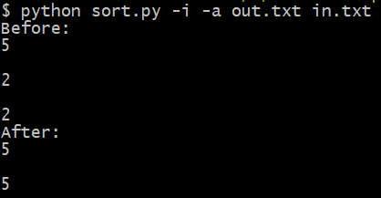

# Сортировка слиянием

Программа представляет собой несложный скрипт на языке Python.

Синтаксис:

```
$ python sort.py <type> <order> <file_out> <file_in>
```

Условные обозначения:

- **\<type\>** - тип входных данных (-i - числа, -s - строки), обязательно указать;
- **\<order\>** - порядок сортировки (-a - по возрастанию, ) - указывать необязательно.
- **\<file_out\>** - имя текстового файла с расширением *.txt, куда будет помещён результат сортировки, обязательно указать;
- **\<file_in\>** - имя текстового файла с расширением *.txt, где содержатся исходные неотсортированные данные, обязательно указать.

Формат входного файла \<file_in\>;
```
element 1
element 2
...
element n
```

Программа выдаст ошибку, если:
- не указаны аргументы (как минимум должен быть указан \<type\>), желательно указать их все;
- указаны неправильные имена входных и выходных файлов.

Пример работы программы:

```
$ python sort.py -i -a out.txt in.txt
```



**Примечание.** Данную программу желательно запускать в среде Python 3.